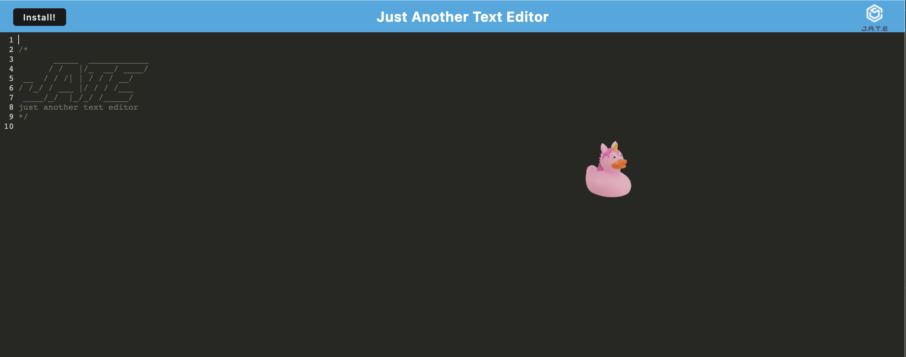
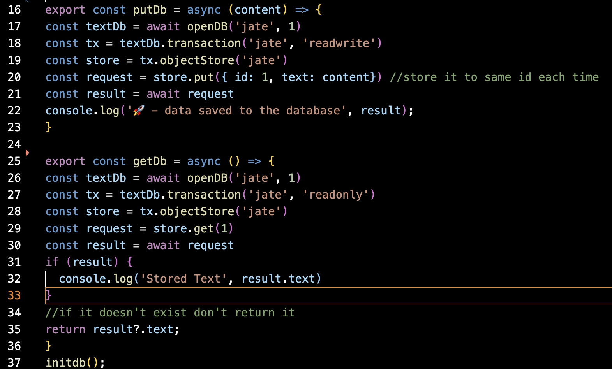

# Text Editor Application
  
  ## Table of Contents
  
  - i. [Description](#description)
  - ii. [General Information](#general-information)
    - i. [Installation](#installation)
    - ii. [Usage](#usage)
  - iii. [Screenshots & Link](#screenshots-&-link)

  ## Description
  
  This is an application that uses Progressive Web Application technologies such as IndexedDB and webpack to build an application more efficiently. 

  ## General Information
  
  ### Installation
  
  To install the necessary dependencies, run the following command:
  
  ```npm i```

### Usage

With JATE, you can save your past text in IndexedDB, which means it will persist past refreshes for 30 days! It will also work offline and uses local storage to store the values in IndexedDB. There is an option to click the installation button and install the app on your browser. 

  ## Screenshots & Link

Screenshot of JATE Application


Screenshot of IndexedDB code


[Link to Application](https://polar-headland-37340.herokuapp.com/)
